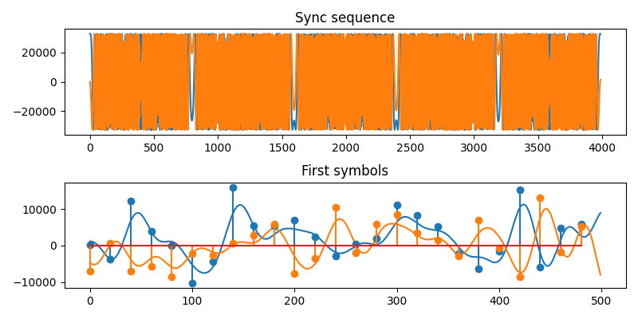

# CV-QKD transmitter DSP, compatible with QOSST

This project is a pure C, "embedded-friendly", implementation of the DSP chain of a CV-QKD transmitter compatible with [QOSST](https://github.com/qosst/qosst-alice). The signals follow the same format as the original Python implementation of QOSST-Alice, and can be demodulated by QOSST-Bob.

This C implementation has been used for early proof-of-concept prototypes (running on the PS of an RFSoC board), and served as a reference implementation for the VHDL port, in particular to generate "ground-truth" signals for the TBs.

Features:
* Fixed point or floating point arithmetic (floating point is needed to initialize LUTs)
* Fast (about 3x the speed of the corresponding GR flowgraph, 10x the speed of the Python implementation)
* No dependencies
* Streaming/online processing is possible
* The implementation and design translate well to hardware acceleration / FPGA

## DSP library

* Include the ```dsp``` routines in your project (eg: in Vitis).
* The source code of the command-line tool can serve as an example of how to initialize and chain the different blocks; though on an embedded platform you will be more likely to adopt a streaming model!

## Command-line tool and unit tests

A small command-line wrapper in C++, that can be run on MacOS or Linux is provided, along with unit tests.

### Requirements

- CMake >= 3.16
- A C/C++ toolchain (gcc/clang)
- Abseil and GoogleTest are needed and will be automatically fetched by CMake

### Building and running the unit tests

```bash
git clone https://github.com/roseopicta/embedded_alice.git
cd embedded_alice
mkdir -p build && cd build
cmake ..
cmake --build .
ctest
```

### Using the CLI tool

The following example generates a signal in base-band, without pilots, that is then plotted:

```bash
./embedded_alice --output_symbols=out_symbols.tsv --output=out_iq.bin --pilot_1_amplitude=0 --pilot_2_amplitude=0 --shift_frequency=0
python ../tools/plot_signal.py
```



